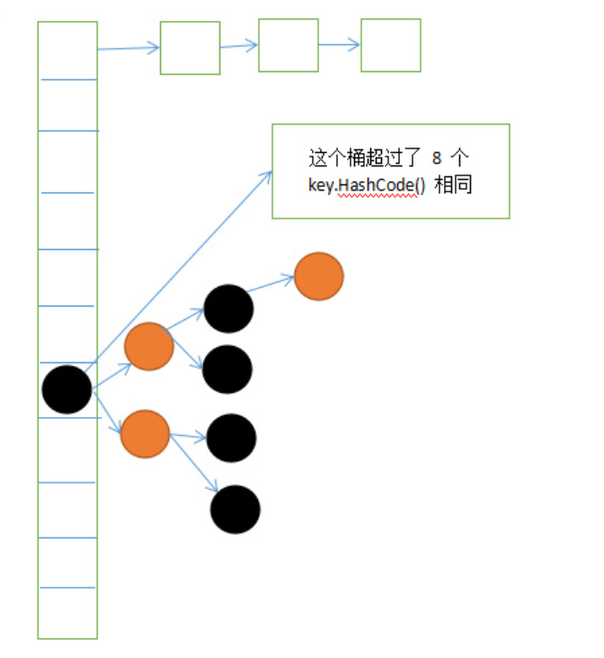
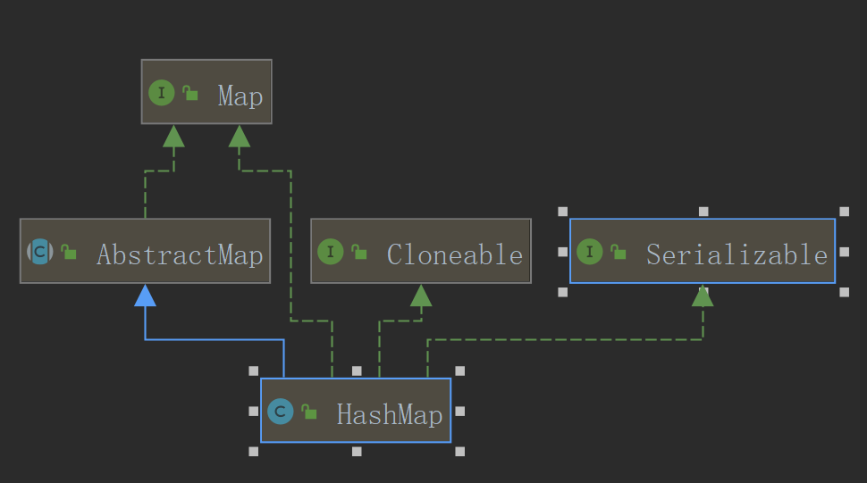
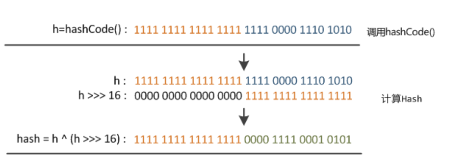
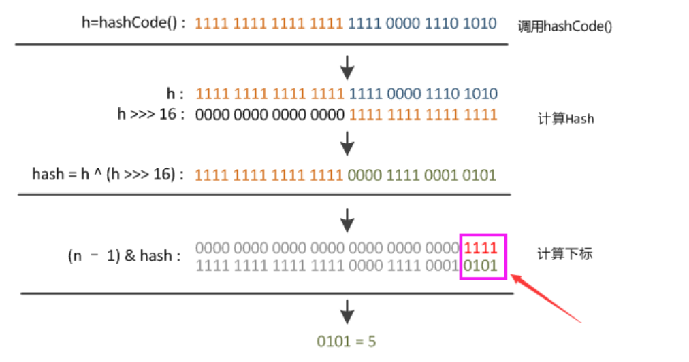

# hashmap源码实现及其使用分析
## 整篇文章核心内容
    1. hashmap概要介绍
    2. haspmap数据结构、常量、成员变量
    3. java中红黑树的增删改查
    4. hashmap中的增删改查核心源码
### 概要
  >hashmap是一个储存key-value键值对的集合，底层数据结构为数组（哈希桶）+链表，并且遍历时为无序，线程不安全。到jdk8时引入：
  1.红黑树提高效率（当链表长度大于8时会变为红黑树）
  2.扩容后hashcode改为无需计算通过最高位bit确定hashcode

  网络图片 侵权请告知
  
### hashmap 的继承关系
  > public class HashMap<K,V> extends AbstractMap<K,V>
    implements Map<K,V>, Cloneable, Serializable
    Cloneable:可复制，浅拷贝
    Serializable：序列化
  

### hashmap 储存结构
  ```java
    /**
   * Basic hash bin node, used for most entries.  (See below for
   * TreeNode subclass, and in LinkedHashMap for its Entry subclass.)
   */
   //单向链表 实现了Map.Entry
  static class Node<K,V> implements Map.Entry<K,V> {
      final int hash;
      final K key;
      V value;
      //下一个节点
      Node<K,V> next;

      Node(int hash, K key, V value, Node<K,V> next) { ... }
      public final K getKey()        { return key; }
      public final V getValue()      { return value; }
      public final String toString() { return key + "=" + value; }
      public final int hashCode() { return Objects.hashCode(key) ^ Objects.hashCode(value);}
      public final V setValue(V newValue) { ... }
      public final boolean equals(Object o) { ... }
  }
  ```
### 常量、成员变量
  ```java
  //常量
  //默认初始化容量 1<<4 = 16
  static final int DEFAULT_INITIAL_CAPACITY = 1 << 4; // aka 16
  //最大容量 1<< 30 2^30
  static final int MAXIMUM_CAPACITY = 1 << 30;
  //默认负载因子 （可以大于1 ）用于计算扩容时机 DEFAULT_LOAD_FACTOR*DEFAULT_INITIAL_CAPACITY
  //越大越容易发生碰撞
  static final float DEFAULT_LOAD_FACTOR = 0.75f;
  //当链表数大于8时，变为红黑树
  static final int TREEIFY_THRESHOLD = 8;
  //当红黑树节点小于8时 ，变为链表
  static final int UNTREEIFY_THRESHOLD = 6;
  //扩容的临界值
  static final int MIN_TREEIFY_CAPACITY = 64;

  //成员变量
  //元素节点
  transient Node<k,v>[] table;
  transient Set<map.entry<k,v>> entrySet;
  //存放元素的个数
  transient int size;
  //被修改的次数fast-fail机制
  transient int modCount;
  //临界值 当实际大小(容量*负载因子)超过临界值时，会进行扩容
  int threshold;
  //负载因子
  final float loadFactor;
  ```
### 构造函数
  ```java
    //最重要构造函数（其他都是调用这个）构造时并不会进行扩容当第一次调用put时调用
    public HashMap(int initialCapacity, float loadFactor) {
        //初始容量非负
        if (initialCapacity < 0)
            throw new IllegalArgumentException(Illegal initial capacity:  +
                                               initialCapacity);
        //初始容量大于最大容量,则为最大容量
        if (initialCapacity > MAXIMUM_CAPACITY)
            initialCapacity = MAXIMUM_CAPACITY;
        //负载因子为正
        if (loadFactor <= 0 || Float.isNaN(loadFactor))
            throw new IllegalArgumentException(Illegal load factor:  +
                                               loadFactor);
        this.loadFactor = loadFactor;
        //tableSizeFor通过位运算保证每次初始化值都为2的倍数，具体方式可以见下文
        this.threshold = tableSizeFor(initialCapacity);
    }

    public HashMap(int initialCapacity) {
        this(initialCapacity, DEFAULT_LOAD_FACTOR);
    }

    public HashMap() {
        this.loadFactor = DEFAULT_LOAD_FACTOR;
    }

    public HashMap(Map<!--? extends K, ? extends V--> m) {
        this.loadFactor = DEFAULT_LOAD_FACTOR;
        //Implements Map.putAll and Map constructor.
        putMapEntries(m, false);
    }
  ```
### 关键方法
#### 准备工作
  1. hashcode获取
    ```java
    static final int hash(Object key) {
      int h;
      //高位参与减少碰撞可能
      return (key == null) ? 0 : (h = key.hashCode()) ^ (h >>> 16);
    }
    ```
   - 原因：通过左移使高16位也可以参与到hashcode的计算中
   - 为什么这样做
     - 主要因为下标的计算方式
       >n = table.length;
       index = （n-1） & hash;

   
   设tables为16
   
   >由上图可以看到，只有hash值的低4位参与了运算。
这样做很容易产生碰撞。设计者权衡了speed, utility, and quality，将高16位与低16位异或来减少这种影响。设计者考虑到现在的hashCode分布的已经很不错了，而且当发生较大碰撞时也用树形存储降低了冲突。仅仅异或一下，既减少了系统的开销，也不会造成的因为高位没有参与下标的计算(table长度比较小时)，从而引起的碰撞。
  2. tablesizefor 任何数转2幂次方
      ```java
      /**
       Returns a power of two size for the given target capacity.
       */
      //返回输入一个数返回一个2的倍数 >>> 无符号左移
      static final int tableSizeFor(int cap) {
        // 防止输入的数为2的倍数
          int n = cap - 1;
          n |= n >>> 1;
          n |= n >>> 2;
          n |= n >>> 4;
          n |= n >>> 8;
          n |= n >>> 16;
          return (n < 0) ? 1 : (n >= MAXIMUM_CAPACITY) ? MAXIMUM_CAPACITY : n + 1;
        }
      ```
  - 原理：通过位移运算保证一定是2的倍数
  - 过程：
    - 如果一个数转换为2进制一定是 01xx xxxx
    - 左移1位 011x xxxx
    - 左移2位 0111 1xxx
    - 左移4位 0111 1111
    - 。。。
    - 0111 1111 + 1 = 1000 0000 正好为2的倍数
  - 小结：通过位移大大提高运算速度
  3. 红黑树（本来打算在本文中做介绍但是发现内容太多会提供单独的链接）
### 源码分析
#### put()
##### 流程分析
  - 核心操作在putval()中完成
  - 具体流程
    1. ==步骤 1==
        - tables进行初始化
          >this.threshold = tableSizeFor(initialCapacity);
          初始还时，threshold其实是临界值，实际大小(容量*负载因子)==是不是有人曾经觉得这里赋值有问题==，是因为put时才确定最后的值就放在这里初始化
    2. ==步骤 2==
        - tables的插件节点为空直接插入
    3. ==步骤 3==
        - tables不为空
          - key相同覆盖
          - 红黑树插入
            - key相同则保存节点
          - 链表尾插
            - key相同则保存节点
            - 当链表长度大于8时会变为红黑树
    4. ==步骤 4==
        - 更改保存节点value值
    5. ==步骤 5==
        - 处理size(扩容)
        - 处理modCount（fast-fail机制）
##### 源码分析
  - put源码
    ```java
    //put
    public V put(K key, V value) {
          return putVal(hash(key), key, value, false, true);
      }
    //关键函数
    final V putVal(int hash, K key, V value, boolean onlyIfAbsent,
                       boolean evict) {
            //缓存 tab  p n大小 i
            Node<K,V>[] tab; Node<K,V> p; int n, i;
            //步骤1：tab为空则创建
            //数组table是否为空 扩容resize
            if ((tab = table) == null || (n = tab.length) == 0)
                n = (tab = resize()).length;
            // 步骤2：计算index，并对null做处理
            // (n - 1) & hash 确定元素存放在哪个桶中，桶为空，新生成结点放入桶中
            //(此时，这个结点是放在数组中)
            // 求余方式前提要保证 n 为2的幂次方 这样就可以通过与运算求余
            //即(n-1) & hash == hash / n 除法 n << 3 == n/8
            //为null直接插入
            if ((p = tab[i = (n - 1) & hash]) == null)
                tab[i] = newNode(hash, key, value, null);
            //步骤3：单值存在时
            else {
                Node<K,V> e; K k;
                //key 相同直接覆盖
                if (p.hash == hash &&
                    ((k = p.key) == key || (key != null && key.equals(k))))
                    // e暂时储存p
                    e = p;
                //如果是treenode存在，直接
                else if (p instanceof TreeNode)
                //放入树中
                    e = ((TreeNode<K,V>)p).putTreeVal(this, tab, hash, key, value);
                //为链表
                else {
                  //尾插
                    for (int binCount = 0; ; ++binCount) {
                      //是否为最后一个节点
                        if ((e = p.next) == null) {
                          //插入
                            p.next = newNode(hash, key, value, null);
                            //如果大于阈值直接转为红黑树
                            if (binCount >= TREEIFY_THRESHOLD - 1) // -1 for 1st
                                treeifyBin(tab, hash);
                            //跳出
                            break;
                        }
                        //key 与 插入key是否相同
                        if (e.hash == hash &&
                            ((k = e.key) == key || (key != null && key.equals(k))))
                            break;
                        p = e;
                    }
                }
                //步骤4 处理key重复问题
                // 表示在桶中找到key值、hash值与插入元素相等的结点
                if (e != null) { // existing mapping for key
                    V oldValue = e.value;
                    //onlyIfAbsent flase 或者旧值 为null
                    if (!onlyIfAbsent || oldValue == null)
                        // 替换
                        e.value = value;
                      // 用于LinkedHashMap的回调方法，HashMap为空实现
                    afterNodeAccess(e);
                    //返回旧值
                    return oldValue;
                }
            }
            //步骤5 扫尾工作
            //结构修改
            ++modCount;
            //扩容
            if (++size > threshold)
                resize();
            //插入后回调
            afterNodeInsertion(evict);
            return null;
        }
    ```
  - resize()源码
    - 注释翻译（发现注释非常重要核心思想和注意事项）
      - 初始化或者2倍tables的容量，如果为null，根据字段阈值中保存的初始化目标容量进行分配，否则因为我们使用2次幂进行扩展，bin中的每一个节点必须停留在相同的位置上或者以2进制最高位的移动（原索引+table.length）
    ```java
      /**
       * Initializes or doubles table size.  If null, allocates in
       * accord with initial capacity target held in field threshold.
       * Otherwise, because we are using power-of-two expansion, the
       * elements from each bin must either stay at same index, or move
       * with a power of two offset in the new table.
       *
       * @return the table
       */
      final Node<K,V>[] resize() {
          //步骤1：定义新旧值
          Node<K,V>[] oldTab = table;
          int oldCap = (oldTab == null) ? 0 : oldTab.length;
          int oldThr = threshold;
          int newCap, newThr = 0;
          //步骤2：赋值newCap，newThr
          if (oldCap > 0) {
              //是否超过最大值
              if (oldCap >= MAXIMUM_CAPACITY) {
                  threshold = Integer.MAX_VALUE;
                  return oldTab;
              }
              //符合要求扩大2倍
              else if ((newCap = oldCap << 1) < MAXIMUM_CAPACITY &&
                       oldCap >= DEFAULT_INITIAL_CAPACITY)
                  newThr = oldThr << 1; // double threshold
          }
          else if (oldThr > 0) // initial capacity was placed in threshold
              newCap = oldThr;
          else {               // zero initial threshold signifies using defaults
              newCap = DEFAULT_INITIAL_CAPACITY;
              newThr = (int)(DEFAULT_LOAD_FACTOR * DEFAULT_INITIAL_CAPACITY);
          }
          //赋值newthr、threshold
          if (newThr == 0) {
              float ft = (float)newCap * loadFactor;
              newThr = (newCap < MAXIMUM_CAPACITY && ft < (float)MAXIMUM_CAPACITY ?
                        (int)ft : Integer.MAX_VALUE);
          }
          threshold = newThr;
          @SuppressWarnings({"rawtypes","unchecked"})
          //步骤3：newTab中的每一个节要不原索引，要不原索引+newcap（详细原理之后叙述）
          Node<K,V>[] newTab = (Node<K,V>[])new Node[newCap];
          table = newTab;
          if (oldTab != null) {
              //遍历oldcap
              for (int j = 0; j < oldCap; ++j) {
                  Node<K,V> e;
                  if ((e = oldTab[j]) != null) {
                      //释放oldtab使垃圾回收可以回收
                      oldTab[j] = null;
                      //节点为空直接赋值
                      if (e.next == null)
                          newTab[e.hash & (newCap - 1)] = e;
                      //红黑树节点进行分割
                      else if (e instanceof TreeNode)
                          ((TreeNode<K,V>)e).split(this, newTab, j, oldCap);
                      //链表分割（原位置或者）
                      else { // preserve order
                          //即将要分割的2条链表
                          Node<K,V> loHead = null, loTail = null;
                          Node<K,V> hiHead = null, hiTail = null;
                          Node<K,V> next;
                          do {
                              next = e.next;
                              //高位为0的连表，即索引为原索引
                              if ((e.hash & oldCap) == 0) {
                                  if (loTail == null)
                                      loHead = e;
                                  else
                                      loTail.next = e;
                                  loTail = e;
                              }
                              //高位为0的连表，即索引为原索引+newcap
                              else {
                                  if (hiTail == null)
                                      hiHead = e;
                                  else
                                      hiTail.next = e;
                                  hiTail = e;
                              }
                          } while ((e = next) != null);
                          if (loTail != null) {
                              loTail.next = null;
                              newTab[j] = loHead;
                          }
                          if (hiTail != null) {
                              hiTail.next = null;
                              newTab[j + oldCap] = hiHead;
                          }
                      }
                  }
              }
          }
          return newTab;
      }
    ```
##### 小结
put 调用 putval()执行put操作
 - putval 具体操作
   1. 判断tab是否为空
       - 为空进行resize(扩容并初始化)
   2. 判断插入key是否为tables第一个的值
       - 是，直接插入一个新的节点node（位置为(n - 1) & hash）
       - 说明tables[(n - 1) & hash] 有值
         - key是否相等
           - 直接覆盖
         - treenode
           - 通过putTreeVal()放入树中（树的所有操作放入红黑树中详细讲此处直说作用）
         - 链表
           - 循环遍历尾插插入数据
             - 期间有key相同的则结束==保存此节点，暂存e中==
             - 遍历到尾部直接==新建node节点，暂存e中==
               - 如果新建后节点数大于8进行化树treeifyBin(tab, hash)
           - 如果e != null 说明有重复key 对value 替换并返回旧值即可
       - modCount++ fast-fail机制
       - 判断size与threshold的大小进行扩容
       - 插入回调（为实现，在linkhashmap中有实现）
 - resize
#### get
##### 流程分析
##### 源码分析
- get方法
  ```java
    /**
     * Returns the value to which the specified key is mapped,
     * or {@code null} if this map contains no mapping for the key.
     *
     * <p>More formally, if this map contains a mapping from a key
     * {@code k} to a value {@code v} such that {@code (key==null ? k==null :
     * key.equals(k))}, then this method returns {@code v}; otherwise
     * it returns {@code null}.  (There can be at most one such mapping.)
     *
     * <p>A return value of {@code null} does not <i>necessarily</i>
     * indicate that the map contains no mapping for the key; it's also
     * possible that the map explicitly maps the key to {@code null}.
     * The {@link #containsKey containsKey} operation may be used to
     * distinguish these two cases.
     *
     * @see #put(Object, Object)
     */
     public V get(Object key) {
       Node<K,V> e;
       return (e = getNode(hash(key), key)) == null ? null : e.value;
     }
     /**
     * Implements Map.get and related methods.
     *
     * @param hash hash for key
     * @param key the key
     * @return the node, or null if none
     */
     final Node<K,V> getNode(int hash, Object key) {
          Node<K,V>[] tab; Node<K,V> first, e;int n; K k;
          //判断table、n、first是否为空
          if ((tab = table) != null && (n = tab.length) > 0 &&
              (first = tab[(n - 1) & hash]) != null) {
              if (first.hash == hash && // always check first node
                  ((k = first.key) == key || (key != null && key.equals(k))))
                  return first;
              //从链表或者红黑树查找
              if ((e = first.next) != null) {
                //红黑树查找
                if (first instanceof TreeNode)
                    return ((TreeNode<K,V>)first).getTreeNode(hash, key);
                //链表查找
                do {
                    if (e.hash == hash &&
                        ((k = e.key) == key || (key != null && key.equals(k))))
                        return e;
                } while ((e = e.next) != null);
            }
        }
        return null;
    }
  ```
##### 小结
- get方法比较简单没有什么复杂的逻辑，基本就是判空，不在tables、链表、红黑树查找相应的节点

#### remove
##### 流程分析
##### 源码分析
  - remove
    ```java
     /**
     * Removes the mapping for the specified key from this map if present.
     *
     * @param  key key whose mapping is to be removed from the map
     * @return the previous value associated with <tt>key</tt>, or
     *         <tt>null</tt> if there was no mapping for <tt>key</tt>.
     *         (A <tt>null</tt> return can also indicate that the map
     *         previously associated <tt>null</tt> with <tt>key</tt>.)
     */
     public V remove(Object key) {
       Node<K,V> e;
       return (e = removeNode(hash(key), key, null, false, true)) == null ?
            null : e.value;
          }
     /**
      * Implements Map.remove and related methods.
      *
      * @param hash hash for key
      * @param key the key
      * @param value the value to match if matchValue, else ignored
      * @param matchValue if true only remove if value is equal
      * @param movable if false do not move other nodes while removing
      * @return the node, or null if none
      */
      final Node<K,V> removeNode(int hash, Object key,Object value,
                                 boolean matchValue, boolean movable) {
        Node<K,V>[] tab; Node<K,V> p; int n, index;
        //判断table、n、p是否为空
        if ((tab = table) != null && (n = tab.length) > 0 &&
            (p = tab[index = (n - 1) & hash]) != null) {
            Node<K,V> node = null, e; K k; V v;
            //依次判断hash、key地址、key值是否相等
            //node暂存之后用于删除
            if (p.hash == hash &&
                ((k = p.key) == key || (key != null && key.equals(k))))
                node = p;
            //存于链表或者红黑树中
            else if ((e = p.next) != null) {
              //红黑树中查找
              if (p instanceof TreeNode)
                  node = ((TreeNode<K,V>)p).getTreeNode(hash, key);
              //链表中查找
              else {
                  do {
                      if (e.hash == hash &&
                          ((k = e.key) == key ||
                            (key != null && key.equals(k)))) {
                              node = e;
                              break;
                            }
                            //保存前一个节点用于删除
                            p = e;
                          } while ((e = e.next) != null);
                        }
                      }
                      if (node != null && (!matchValue || (v = node.value) == value ||
                                          (value != null && value.equals(v)))){
                          if (node instanceof TreeNode)
                              ((TreeNode<K,V>)node).removeTreeNode(this, tab, movable);
                              else if (node == p)
                                  tab[index] = node.next;
                              else
                                  p.next = node.next;
                              ++modCount;
                              --size;
                              afterNodeRemoval(node);
                              return node;
                        }
                    }
                    return null;
              }
    ```

##### 小结
